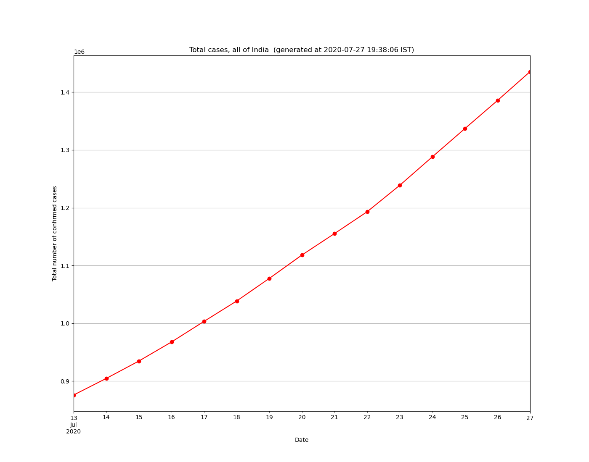
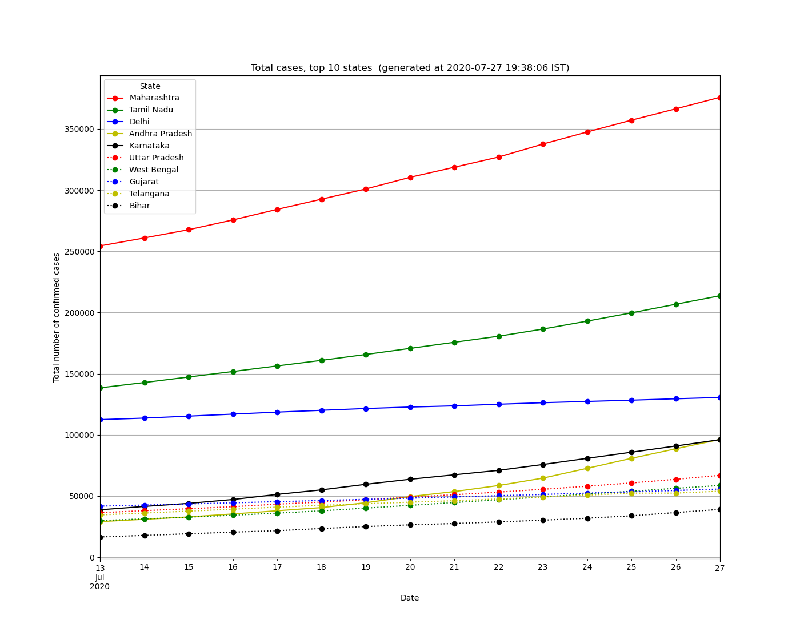
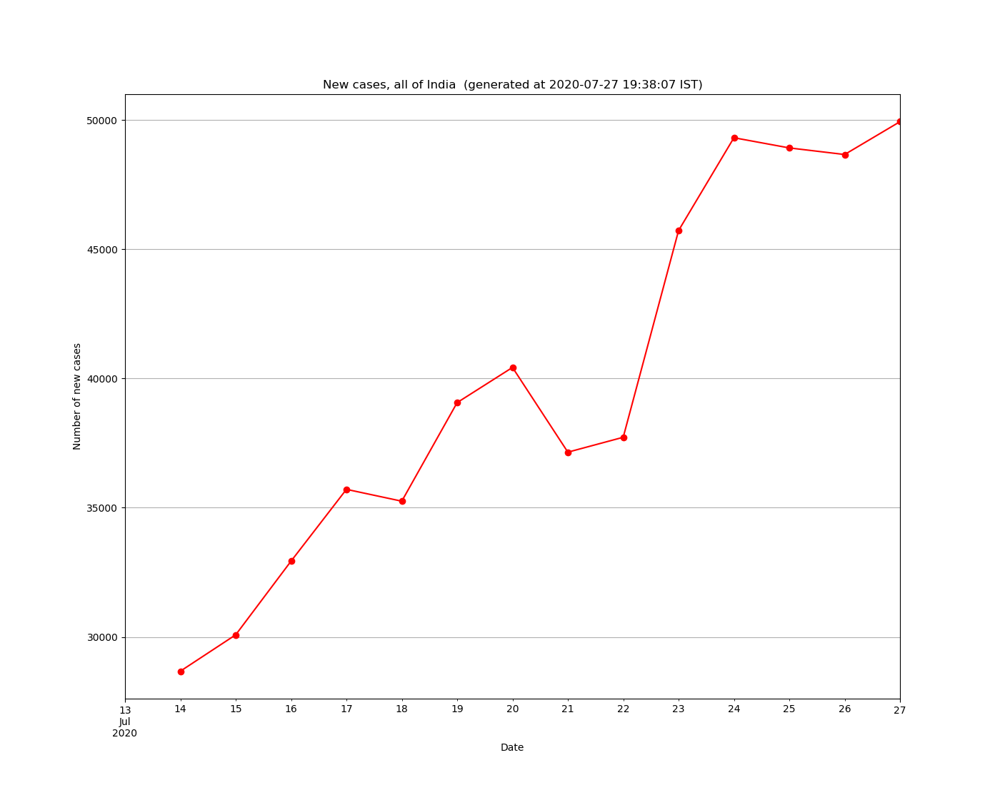
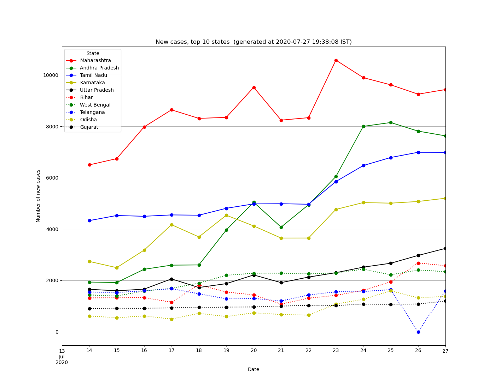

Covid19 India data collector
=============================

A script to fetch data from Indian govt site (https://www.mohfw.gov.in)
as they don't keep historical data. Couple of systemd unit files for
running the script every hour and update the csv data. Systemd unit
files are not needed if you use crontab.

The following should work as a crontab entry provided the path to the
script and data file are given correctly!

@hourly <covid-india.py> --savefig <covid19-india-data.csv>

Same script generates plots of top 10 states/UTs with total confirmed
cases and new cases.

